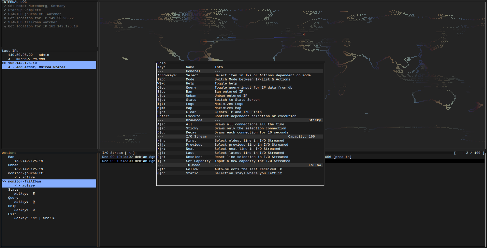
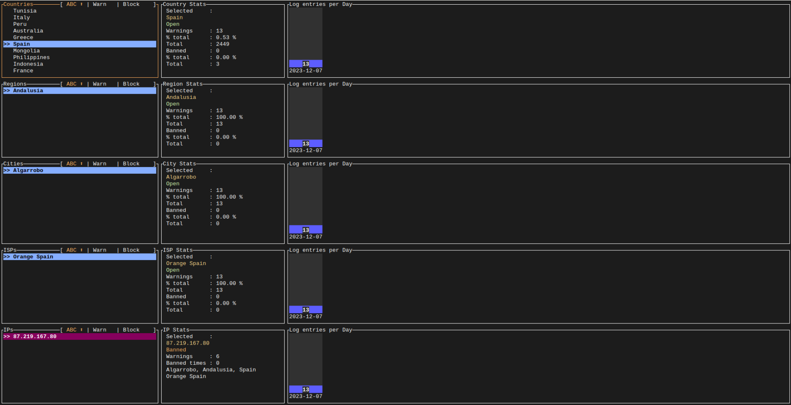

# succed2Ban-tui

Made with [ratatui](https://github.com/ratatui-org/ratatui/) 

## Short

Overcomplicated way to tail -f your SSH logs.

Only made for myself to learn Rust, use at own discretion.

Issues / Todos:

1. Stopping of watchers does not work without Ctrl+C after shutdown !!!
2. Some colors may default to default terminal colors which breaks the theme
3. Actions need refactor badly
4. Configuration of fail2ban log path and Hotkeys
5. Refactor for testing
6. Text wrapping

## Usage

1. cargo run

2. Press Tab to skip Startup menu

3. Start fail2ban and/or journalctl watcher

4. Watch

## About

I once had trouble setting up fail2ban so I had to spent some time looking at logs, so I thought why not spent some more time looking at logs?
I then build a similar app in Python, which was much more limited and limiting. 
After deciding to learn Rust I thought this was a good opportunity to spent even more time looking at logs. So here we are.

succeed2Ban-tui monitors journalctl and fail2ban SSH logs. 
It fetches geodata for incoming IPs from [ip-api.com](https://ip-api.com/). 
Stores geodata in a SQLite file in order to keep necessary requests to a minimum and to review log statistics.

### Stat screen

Allows for blocking based on:

1. Country
2. Region
3. City
4. ISP

But in the end this is more of an overinflated cMatrix with tail -f on top. So enjoy your CPU cycles :)

